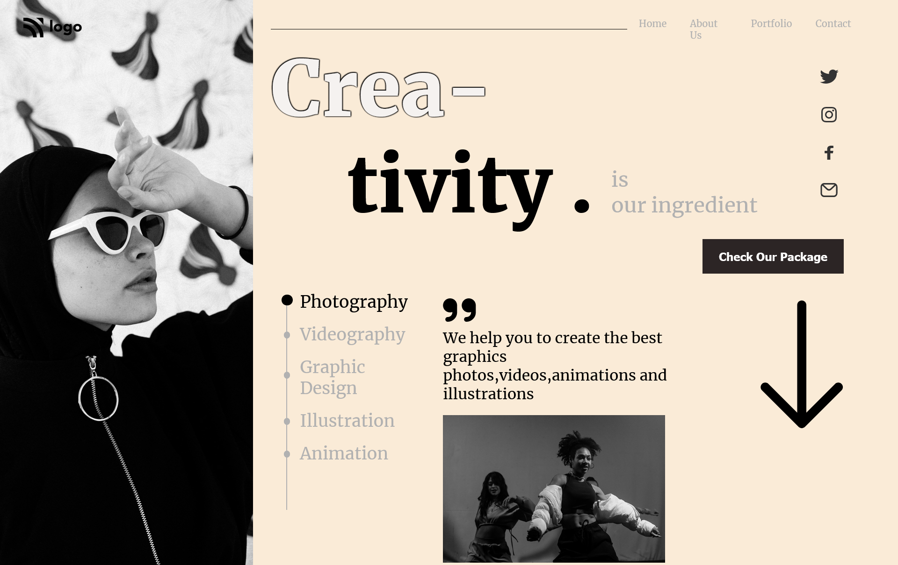

## Table of contents

- [Table of contents](#table-of-contents)
- [Overview](#overview)
  - [The challenge](#the-challenge)
  - [Screenshot](#screenshot)
  - [Links](#links)
- [My Process](#my-process)
  - [Built with](#built-with)
  - [What I learned](#what-i-learned)
  - [Continued Developement](#continued-developement)
- [Author](#author)
  


## Overview

### The challenge

Make a Landing Page for Dance Academy .

### Screenshot



### Links

- Solution URL : [Add solution URL here]()

## My Process

### Built with 

- Semantic HTML5 markup
- CSS custom poperties
- Flexbox


### What I learned

- Learn how to use svg in the html markup
- Learn how to make time line with pseudo selector in css
- Learn how to be creative with css box shadow poperty

```css
.timeline p:first-child::before {
    background-color: #000000;
    width: 13px;
    height: 8px;
    position: absolute;
    left: -17%;
    top: 17%;
}
```

### Continued Developement

- I want to do more practice of Css Box Shadow .

## Author

- Kapil Kharera
- Linkedin - [Kapil Kharera](https://www.linkedin.com/in/kapil-kharera-191b83245/)